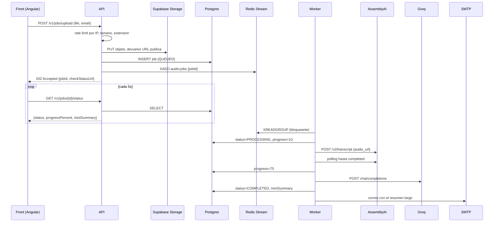

# Arquitectura — Media Summary Backend

Servicio Spring Boot que recibe un archivo de audio, lo transcribe, genera un
resumen con un LLM y lo envía por correo. El cliente no espera: el upload
responde de inmediato con un `jobId` y el front consulta el estado por polling.

- **Runtime:** Java 11, Spring Boot 2.7.18
- **Persistencia:** PostgreSQL vía `JdbcTemplate` (sin JPA)
- **Cola:** Redis Streams
- **Servicios externos:** AssemblyAI (transcripción), Groq (resumen),
  Supabase Storage (archivos), SMTP (entrega)

---

## Flujo completo



El punto clave: **el audio nunca viaja entre la API y el worker**. La API lo
sube a Supabase Storage y encola solo el `jobId`; el worker lee la URL pública
desde la base. Por eso ambos procesos pueden vivir en contenedores distintos
sin volumen compartido.

---

## Componentes

| Clase | Responsabilidad |
|---|---|
| `JobController` | Endpoints REST, validaciones de entrada, rate limiting |
| `UploadRateLimiter` | Ventana fija por IP, en memoria |
| `JobService` | Orquesta el procesamiento: AssemblyAI, Groq, correo |
| `JobQueueService` | Productor y consumidor del Redis Stream |
| `JobWorker` | `@Scheduled` que sondea la cola y despacha al pool |
| `JobRepository` | SQL contra `processing_job` |
| `SupabaseStorageService` | Subida de audio y limpieza programada |
| `EmailService` | Plantillas HTML y envío SMTP |
| `AsyncConfig` | Pool `audio-processor-*` y habilitación de `@Scheduled` |

### API y worker son el mismo artefacto

Un único jar; `APP_WORKER_ENABLED` decide el rol:

```
APP_WORKER_ENABLED=false  -> solo API (JobWorker no se instancia)
APP_WORKER_ENABLED=true   -> tambien worker
```

`JobWorker` lleva `@ConditionalOnProperty(name = "app.worker.enabled", havingValue = "true")`,
así que en modo API el bean simplemente no existe. `docker-compose.back.yml`
levanta los dos roles por separado; en Render hoy corre un solo servicio con
ambos activos.

---

## Modelo de datos

Tabla única: **`processing_job`** (singular).

| Columna | Notas |
|---|---|
| `id` | `BIGSERIAL`, clave generada |
| `email` | destinatario del resumen |
| `status` | `QUEUED`, `PROCESSING`, `COMPLETED`, `ERROR` |
| `audio_url` | URL pública en Supabase Storage |
| `transcript_id` | id de AssemblyAI; permite resolver el webhook |
| `mini_summary` | resumen corto que consume el front |
| `progress_percent` | 0, 10, 1-99 durante polling, 75, 100 |
| `status_detail` | etiqueta legible: `queued`, `transcribing`, `summarizing` |
| `created_at`, `completed_at`, `processing_time_ms`, `error_message` | |

El resumen largo **no se persiste**: se genera y se envía por correo en el
mismo paso. Solo el `mini_summary` queda en base.

---

## Endpoints

| Método | Ruta | Notas |
|---|---|---|
| `POST` | `/v1/jobs/upload` | multipart `file` + `email`. `202` con `jobId`; `429` si excede el rate limit |
| `GET` | `/v1/jobs/{jobId}/status` | lo que consume el polling del front |
| `GET` | `/v1/jobs/all` | diagnóstico, sin paginar |
| `GET` | `/v1/jobs/health` | `OK` fijo |
| `GET` | `/v1/jobs/pool` | métricas de HikariCP |
| `POST` | `/v1/jobs/webhook` | callback de AssemblyAI |

También está `/actuator` expuesto por Spring Boot.

---

## Configuración

Todo se inyecta por entorno; `application.properties` solo define los defaults.

**Obligatorias**

```
DATABASE_URL, DATABASE_USERNAME, DATABASE_PASSWORD
REDIS_HOST, REDIS_PORT, REDIS_PASSWORD, REDIS_SSL
SUPABASE_URL, SUPABASE_SERVICE_KEY, SUPABASE_STORAGE_BUCKET
ASSEMBLYAI_API_KEY
GROQ_API_KEY, GROQ_API_URL
SPRING_MAIL_HOST, SPRING_MAIL_PORT, SPRING_MAIL_USERNAME, SPRING_MAIL_PASSWORD
```

**Con default, útiles para operar**

| Variable | Default | Para qué |
|---|---|---|
| `GROQ_MODEL` | `openai/gpt-oss-20b` | cambiar de modelo sin redeploy |
| `APP_MAIL_FROM` | `spring.mail.username` | remitente cuando el usuario SMTP no es una dirección |
| `APP_WORKER_ENABLED` | `true` | separar API de worker |
| `APP_RATELIMIT_MAX_UPLOADS` | `10` | uploads por IP y por ventana |
| `APP_RATELIMIT_WINDOW_MINUTES` | `60` | tamaño de la ventana |
| `APP_RATELIMIT_ENABLED` | `true` | desactivar durante pruebas |
| `APP_QUEUE_FAILURE_LOG_INTERVAL_MS` | `60000` | throttle del log cuando Redis está caído |
| `APP_CORS_ALLOWED_ORIGINS` | `*` | origen permitido del front |
| `ASSEMBLYAI_WEBHOOK_URL` | vacío | ver advertencia abajo |
| `APP_CLEANUP_DAYS` | `7` | retención de audios en Storage |
| `SPRING_MAIL_CONNECTION_TIMEOUT_MS` | `10000` | corta envíos colgados; sin esto JavaMail bloquea para siempre |

Notas de proveedor:

- **Upstash exige TLS** → `REDIS_SSL=true`. Con `false` la conexión falla.
- **Gmail exige App Password** (con 2FA activa); la contraseña normal devuelve
  `535 Authentication failed`. Y solo permite enviar desde la propia cuenta:
  con Gmail, no definas `APP_MAIL_FROM`.

---

## Comportamiento ante fallos

| Falla | Efecto |
|---|---|
| Postgres caído | La app **no arranca** — deliberado: sin base no funciona nada |
| Redis caído | La app arranca; `/status` y `/health` siguen sirviendo, `/upload` responde 500 |
| Supabase caído | Solo falla `/upload`, por request |
| AssemblyAI o Groq fallan | Job a `ERROR` y correo de error al usuario |
| SMTP falla | **Se traga la excepción**: el job queda `COMPLETED` y el front muestra éxito aunque el correo nunca salga. Verificar en logs |

Reintentos: no hay. Un job que falla queda en `ERROR` y no se reprocesa; el
mensaje se hace `XACK` en el `finally` de `JobWorker.process` pase lo que pase.

Idempotencia parcial: `processJob` sale temprano si el job ya está `COMPLETED`,
así que un redeliver no duplica trabajo ya terminado.

---

## Puntos a tener en cuenta

**El webhook de AssemblyAI no reemplaza al polling.** Si defines
`ASSEMBLYAI_WEBHOOK_URL`, `transcribeWithAssemblyAI` lo manda en el request
pero igual llama a `pollTranscriptionResult`. Ambos caminos generan resumen y
envían correo, así que el usuario podría recibirlo **dos veces**. Hoy la
variable está vacía y solo corre el polling. Si vas a activarla, primero hay
que cortocircuitar el polling.

**El DDL del README no coincide con el código.** El README y
`db/create_indexes.sql` usan `processing_jobs` (plural) y omiten `audio_url`,
`transcript_id`, `progress_percent` y `status_detail`. El código usa
`processing_job` (singular) con esas columnas. Sobre una base nueva creada con
ese DDL, la app falla.

**`PENDING` no es un estado real.** Aparece como fallback en `JobRepository.save()`
y en el índice parcial de `create_indexes.sql`, pero `createJob` siempre fija
`QUEUED` antes de guardar, así que nunca se alcanza.

**El rate limiter es por instancia.** Está en memoria a propósito, para que siga
funcionando cuando Redis no responde. Con varias instancias de API el límite
efectivo se multiplica por el número de instancias.

**`/v1/jobs/all` no pagina.** Hace `SELECT * FROM processing_job` sin límite.

---

## Desarrollo local

```bash
docker compose -f docker-compose.back.yml up --build
```

Levanta Postgres, Redis, la API en `:8080` y un worker aparte. Necesitas un
`.env` con las claves de AssemblyAI, Groq, Supabase y SMTP; Postgres y Redis
son locales y no requieren cuenta.

Sin Docker:

```bash
mvn spring-boot:run
```

Requiere Postgres y Redis accesibles y las variables de entorno exportadas.
